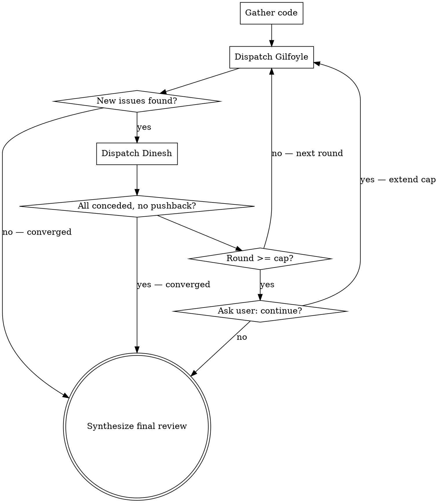

# Dinesh vs Gilfoyle Code Review

Two-agent adversarial code review inspired by HBO's Silicon Valley. Gilfoyle attacks the code with withering technical precision. Dinesh defends it with flustered competence. The banter entertains; the back-and-forth produces genuinely better reviews.

## Invocation

- `/dg` — review git diff (staged + unstaged)
- `/dg 3` — git diff, max 3 rounds
- `/dg src/auth.ts` — review specific file
- `/dg src/auth.ts 3` — specific file, 3 rounds max

## Parse Arguments

1. No args → target = git diff, cap = 5
2. Number only → target = git diff, cap = that number
3. Path only → target = that path, cap = 5
4. Path + number → target = path, cap = number

## Orchestration

### Step 1: Gather Code

**If git diff:**
```bash
git diff HEAD
git diff --staged
```
Combine both diffs. If both are empty, tell the user there's nothing to review.

**If file/path:**
Read the target file(s). If path is a directory, read all source files in it.

### Step 2: Run the Debate

Initialize: `round = 0`, `debate_history = []`



**Each round:**

1. **Dispatch Gilfoyle agent** (Agent tool, general-purpose) with:
   - Full content of `gilfoyle-agent.md` from this skill's directory
   - The code under review
   - Full debate history
   - Round number
   - Instruction: "You are doing research only — read the code and produce your review. Do NOT edit any files."

2. **Display Gilfoyle's banter** to the user.

3. **Check convergence:** Parse Gilfoyle's FINDINGS section. If all findings are repeats from previous rounds → converge.

4. **Dispatch Dinesh agent** (Agent tool, general-purpose) with:
   - Full content of `dinesh-agent.md` from this skill's directory
   - The code under review
   - Gilfoyle's latest full response
   - Full debate history
   - Round number
   - Instruction: "You are doing research only — read the code and produce your defense. Do NOT edit any files."

5. **Display Dinesh's banter** to the user.

6. **Check convergence:** Parse Dinesh's FINDINGS section. If every point is `[concede]` with zero `[defend]` or `[dismiss]` → converge.

7. **Append both responses to debate_history**, increment round.

8. **If round >= cap:** Ask user: *"These two could go all night. Continue for more rounds? (y/N)"*
   - Yes → extend cap by original amount, continue loop
   - No → proceed to synthesis

**Convergence announcements** (pick one that fits):
- "Gilfoyle has run out of things to hate. Unprecedented."
- "Dinesh has conceded defeat. As expected."
- "These two are going in circles. Separating them before it gets physical."

### Step 3: Synthesize Final Review

After the debate ends, produce a structured summary from the full debate transcript.

**Display format:**

```markdown
## Dinesh vs Gilfoyle Review — [target]
### [N] rounds of mass destruction

---
### Best of the Banter
[2-4 of the funniest or most insightful exchanges from the debate]

---

### Verdict

#### Critical (Gilfoyle won, Dinesh conceded)
[Issues where Dinesh couldn't mount a defense — these are real and need fixing]
- `file:line` — issue — fix

#### Important (Gilfoyle won after debate)
[Issues Dinesh tried to defend but Gilfoyle's argument was stronger]
- `file:line` — issue — fix

#### Contested (Dinesh held his ground)
[Issues where Dinesh's defense was valid — code is likely fine]
- `file:line` — what was raised — why the defense holds

#### Dismissed (Gilfoyle was nitpicking)
[Issues both sides agree don't matter]
- `file:line` — what was raised — why it's a non-issue

### Strengths
[Things even Gilfoyle grudgingly acknowledged were good]

### Score
Gilfoyle: X | Dinesh: Y
[Tongue-in-cheek tally of who won more arguments]

### Recommended Changes
[Clean checklist — no banter, no context, just what to do]
- [ ] `file:line` — what to change
- [ ] `file:line` — what to change
- [ ] ...

If no changes needed: "Nothing to fix. Gilfoyle is furious."
```

## Key Principles

- **The banter is the feature, not decoration** — it keeps reviews entertaining and thorough
- **Dinesh's concessions are the strongest signal** — when he can't defend, it's a real issue
- **Successful defenses validate code** — if Dinesh can justify it under Gilfoyle's assault, it's solid
- **Always end with actionable summary** — fun on the outside, useful on the inside
- **Be technically correct** — the humor only works if the technical substance is real
